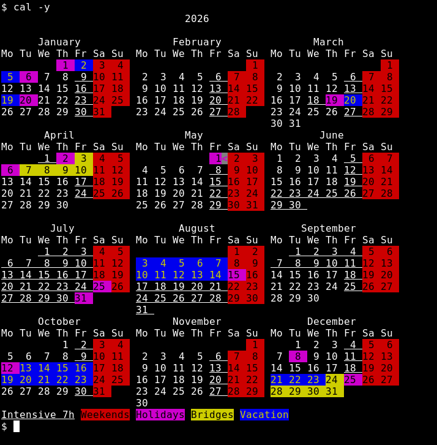
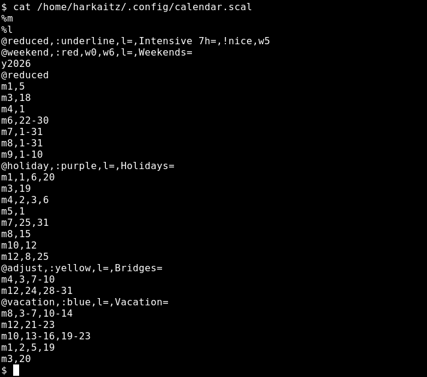

# SIMPLE CALENDAR

This is an implementation of the POSIX `cal` utility *with colors*.

Read the [usage](./scal.1.md) and [configuration](./calendar.scal.5.md)
manpages for more information.

## Comparison with other `cal` implementations

- [GNU cal](https://www.gnu.org/software/coreutils/manual/html_node/cal-invocation.html): Too complicated.
- ncal, BSD cal: No colors.
- Busybox cal: No colors, no support for monday-first calendars.
- ccal: No configurable colors, too complicated.

## Style guide

This project follows the OpenBSD kernel source file style guide (KNF).

Read the guide [here](https://man.openbsd.org/style).

## Collaborating

Feel free to open bug reports and feature/pull requests.

More software like this here:

1. [https://harkadev.com/prj/](https://harkadev.com/prj/)
2. [https://devreal.org](https://devreal.org)
